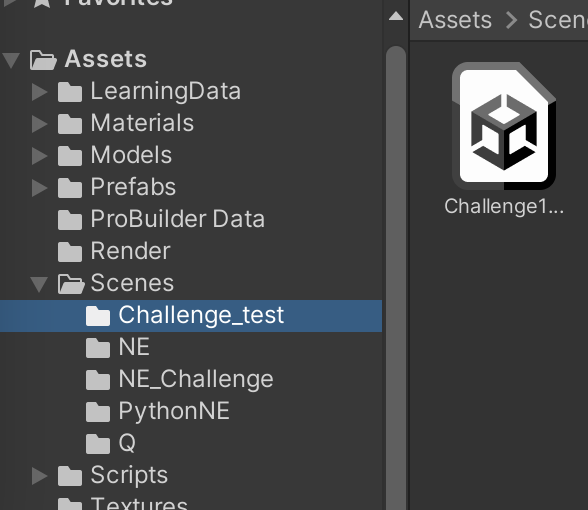

# 自動運転プログラムの改良


## 概要
このサンプルコードでは, ニューロ進化(Neuro Evolution)とQ学習で車が各コースを走れるようになる進化・学習をします. \
そのままのコードだと, Q学習ではコースの一部を走れるようになるところまで進化します. また, ニューロ進化ではすべてのコースを走れるようになるところまで進化します. そのため, この課題でニューロ進化を用いる場合は, 単にコースを走り切るだけではなく, 障害物を避けたりするなどの走る+αの動作を車ができるようになることが期待されています. 


## 目次
****
- [自動運転プログラムの改良](#自動運転プログラムの改良)
  - [概要](#概要)
  - [目次](#目次)
  - [ダウンロード](#ダウンロード)
      - [動作確認](#動作確認)
  - [Unity Editor上での操作説明](#unity-editor上での操作説明)
    - [Sceneの実行](#sceneの実行)
  - [ソースコード](#ソースコード)
  - [設定されているChallengeについて](#設定されているchallengeについて)
    - [Challenge 1](#challenge-1)
    - [Challenge 2](#challenge-2)
    - [Challenge 3](#challenge-3)
    - [Challenge 4](#challenge-4)
  - [Python連携について](#python連携について)
    - [準備](#準備)
    - [使い方](#使い方)
    - [SceneをPython対応させるには](#sceneをpython対応させるには)

## ダウンロード
[Google Driveのリンク](https://drive.google.com/drive/folders/1WvrHWuLwVmsIn7PaLSVdql5R_vfBIUnh?usp=sharing)からダウンロードし, 適当なフォルダで展開してください. その後, Unity HubのOpenから展開した.projフォルダを開いてください. 

Google DriveにはUnityのライブラリは上げていませんが, Unity Hubで開く際に自動的に生成されます.

macOS, Unity 2021.3.1f1以外で開く際には警告が出ますが, 警告に従ってバージョンの変更やパッケージのインストールなどをすれば以下の環境で動作することを確認しています. 

#### 動作確認
- macOS Monterey 12.4
- Windows 10
- Windows 11
- Unity 2021.3.0f1
- Unity 2021.3.1f1
- Unity 2021.3.3f1

## Unity Editor上での操作説明
### Sceneの実行
ProjectタブのAssets > Scenesから選択したいシーンをダブルクリックして開きます.



画面上部の再生ボタンを押すと学習が始まります. 学習中にはGame画面に表示されるスライダでプログラムの実行速度を調整できます. コンピュータへの負荷を少なくしたい場合は, 描画をオフにすることもできます。

## ソースコード
- `/Assets/Scripts/Car/CarAgent.cs`\
  車をスタート地点にセットし, Brainにセンサーなど環境の値を渡します. Brainからの指示が来るのでそれに従って車を運転します. 衝突を検知すると報酬値を返し, 車をリセットします. 
- `/Assets/Scripts/Car/CarController.cs`\
  車の入力に対する動作が記述してあります (ex. `steering`の値を受け取りタイヤを回転させる)

教科書(Mind Render AI Drill)の3, 4, 5章にサンプルコードが何をしているかがわかりやすく書いてあるので, 詳しくはそちらもご覧ください.

## 設定されているChallengeについて
この課題ではあらかじめChallengeが設定されています. もちろん必ずしもこのChallengeに沿って課題を進める必要はありませんが参考にしてみてください. シーンファイルは以下にあります. 各シーンを開き再生を押すとニューロ進化による学習が始まります. \
`/Assets/Scenes/NE_Challenge/Challenge*.unity`
### Challenge 1
コース上に数個の岩が設置されるのでその岩に当たらずにコースを一周できるように進化・学習させる(岩の位置は固定)
### Challenge 2
Challenge1と同じくコース上に数個の岩が設置されるのでその岩に当たらずにコースを一周できるように進化・学習させる(岩の位置は固定ではなくランダム)
### Challenge 3
坂の上から岩が転がり落ちてくるのでその岩に当たらずにコースを一周できるように進化・学習させる
### Challenge 4
コース上に一定間隔で岩が置かれていて近づくと転がり落ちてくる. 岩の大きさや速度はランダム

---

## Python連携について
Pythonを使うと, Numpyなどの数値計算モジュールやTensorflow, PyTorchなどの機械学習モジュールを用いることができます. 詳しくは教科書等を参考にしてください. 

### 準備
必要なパッケージがダウンロードされていない場合は`pip`などで適宜ダウンロードしてください. 
```shell
$ pip install numpy
$ pip install asyncio
$ pip install asyncio-dgram
$ pip install torch
```

### 使い方
1. ターミナルで`/env/src/PyNECommunicator.py`を実行している状態にします
```shell
$ python /env/src/PyNECommunicator.py
```
2. `/Asset/Scenes/PythonNE/`下のシーンファイルをUnityから実行します

現在`/env/src/PyNNBrain.py`は`NNBrain.cs`をPytorchに翻訳したものですが, Pythonで新しいニューラルネットワークの構造なども定義することができます. 

### SceneをPython対応させるには
通常のシーン(Challengeなど)をPythonに対応したシーンにするには以下の変更が必要です. 詳しくは既にPython対応しているシーンを参照して下さい. 
- EventSystemの追加\
ユーザーからの入力を受け取るものです. 今回はPythonからの入力を受け取っています. Python対応済みのシーンからのコピーで問題ないはずです.
- Environmentを`PyNEEnvironment.cs`にする\
`NEEnvironment.cs`を`PyNEEnvironment.cs`にします. また, Agent Prefabを`Car@Blue`に設定します. 
